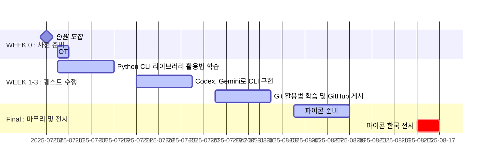

# 🖱️ CLIck Me

## 퀘스트 소개
> 🔗 [**퀘스트 자세히 보기**](https://animated-pulsar-e0c.notion.site/CLIck-Me-220db6076de280cc950bc5a371e94421)  

🖱️ CLIck Me: 나를 소개하는 가장 개발자다운 방법, CLI 자기소개서  

HelloPY 써머 퀘스트 `CLIck Me`는  
3주간 Python과 생성형 AI로 나를 소개하는 커맨드라인(CLI) 프로그램을 직접 만들고,  
이를 GitHub에 포트폴리오로 정리하는 실습형 프로젝트입니다.  

👾 직접 기획하고 구현하는 Python CLI 라이브러리 활용법  
👾 Codex, Gemini로 CLI 구현  
👾 Git 활용법 학습 + GitHub 게시 & 발표 기회까지!  

## 퀘스트 팀 소개
| 역할 | 이름 | SNS 링크 |
| --- | --- | --- | 
| Mentor | 👑 임주영 |  |
| Mentor | 👑 김대현 |  |
| Mentee | - | - |
| Mentee | - | - |
| Mentee | - | - |
| Mentee | - | - |

## ⏰ 퀘스트 일정

## About HelloPY
HelloPY는 주니어 파이썬 유저들을 위한 커뮤니티입니다.  
‘파이썬으로 세상을 연결하는 주니어’, 그리고 성장을 꿈꾸는 이들이 함께  
기획, 개발, 발표, 네트워킹까지 — 단계별로 실력을 쌓고, 더 넓은 세상으로 나아갈 준비를 합니다.  

> 🔗 [**HelloPY 링크트리**](https://linktr.ee/HelloPY2025?utm_source=linktree_profile_share&ltsid=b1b968a8-a058-4609-a866-3f9bf880901d)  

> 🔗 [**HelloPY 행동강령**](https://hello-py.com/coc)  

## License
> 🔗 [**MIT License**](/LICENSE)